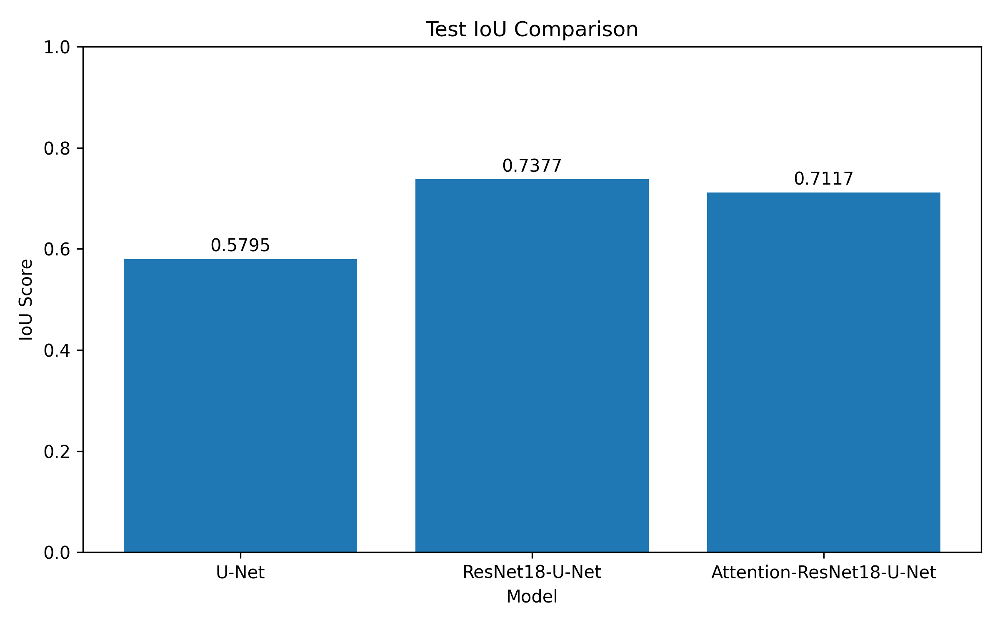
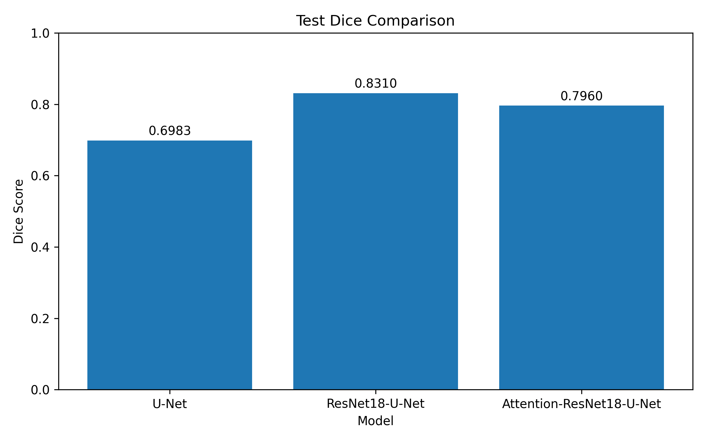
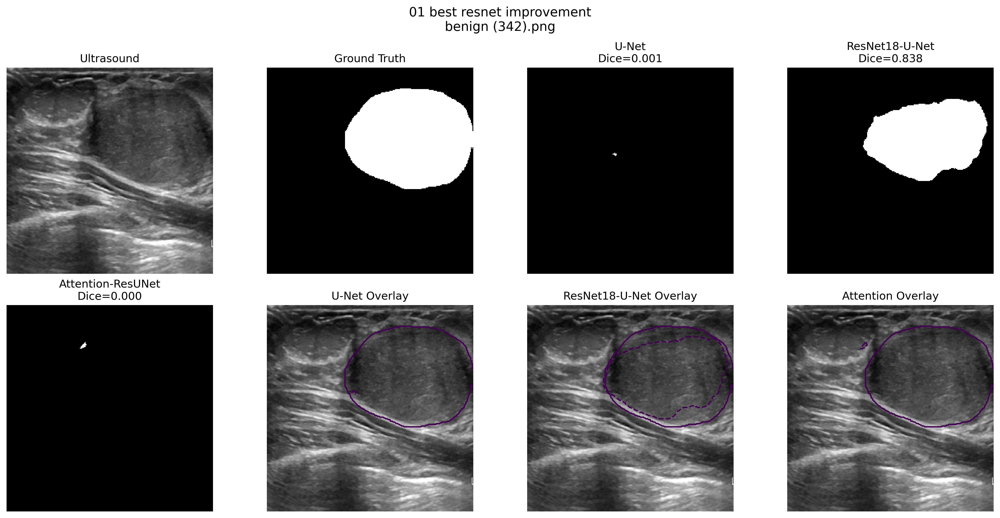
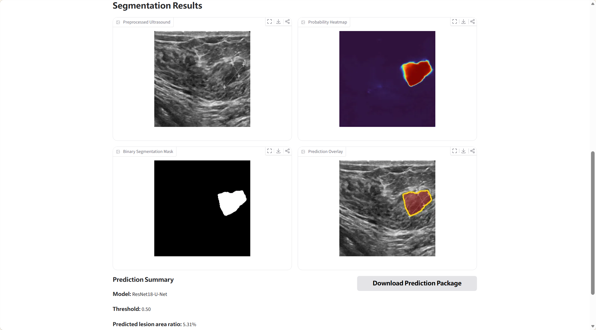
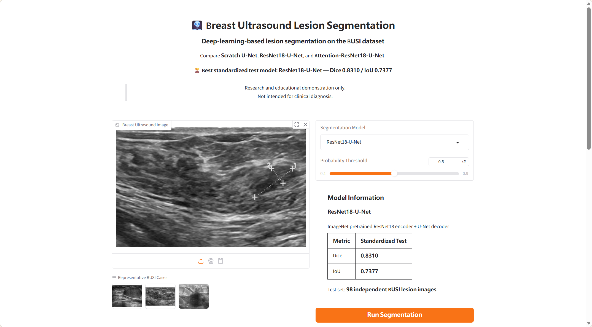

# Breast Ultrasound Lesion Segmentation

基于 PyTorch 的乳腺超声病灶分割项目，对比 Scratch U-Net、
ImageNet 预训练 ResNet18-U-Net 与 Attention-ResNet18-U-Net，
并完成独立测试、病例级误差分析及 Gradio 推理 Demo。

> 本项目仅用于算法研究和工程展示，不用于临床诊断。

---

## 1. Project Motivation

乳腺超声具有散斑噪声强、组织对比度低、病灶边界模糊以及病灶形态差异大的特点。

在有限样本条件下，从零训练的 U-Net 容易出现：

- 病灶漏分割
- 预测区域碎片化
- 边界定位不准确
- 泛化性能不足

因此，本项目主要研究：

> 在 BUSI 小样本乳腺超声数据上，预训练视觉编码器和注意力机制能否提升病灶分割性能？

---

## 2. Dataset

使用 Breast Ultrasound Images Dataset (BUSI)。

本项目仅使用具有病灶标注的 benign 和 malignant 图像：

| Category | Number |
|---|---:|
| Benign | 437 |
| Malignant | 210 |
| Total | 647 |

按照病灶类别和 lesion size 进行分层划分：

| Split | Number |
|---|---:|
| Train | 452 |
| Validation | 97 |
| Test | 98 |

采用严格互斥的 Train / Validation / Test split，避免数据泄漏。

对于存在多个 lesion mask 的样本，使用 pixel-wise OR 合并为统一 Ground Truth。

输入图像统一 resize 至 `256 × 256`。

---

## 3. Models

### 3.1 Scratch U-Net

经典 Encoder-Decoder U-Net，从随机初始化开始训练，作为 Baseline。

### 3.2 ResNet18-U-Net

使用 ImageNet 预训练 ResNet18 作为 Encoder，
结合 U-Net Decoder 完成像素级病灶分割。

主要目的：

- 利用迁移学习改善小样本条件下的特征表示
- 提升病灶纹理与边界特征提取能力
- 改善模型泛化能力

### 3.3 Attention-ResNet18-U-Net

在 ResNet18-U-Net 基础上进一步加入 scSE
(Spatial and Channel Squeeze & Excitation) Attention，
从空间和通道两个维度重新加权 Decoder 特征。

---

## 4. Training Pipeline

BUSI Dataset
      ↓
Strict Train / Val / Test Split
      ↓
Image & Mask Preprocessing
      ↓
Paired Data Augmentation
      ↓
Segmentation Model
      ↓
Dice + BCE Loss
      ↓
Validation Model Selection
      ↓
Independent Test Evaluation
      ↓
Per-case Error Analysis

高级模型训练阶段采用：
- Horizontal Flip
- Small-angle Rotation
- Shift / Scale
- Brightness / Contrast augmentation
Image 与 Mask 始终执行同步几何变换。

## 5.Quantitative Results
最终指标统一采用preprocessing，在98张独立Test图像上逐病例计算Dice/IOU后取平均。
| Model | Test Dice | Test IoU |
|---|---:|---:|
| Scratch U-Net | 0.6983 | 0.5795 |
| **ResNet18-U-Net** | **0.8310** | **0.7377** |
| Attention-ResNet18-U-Net | 0.7960 | 0.7117 |
ResNet18-U-Net 相比 Scratch U-Net：
- Dice：0.6983 → 0.8310，提升 13.27 个百分点
- IoU：0.5795 → 0.7377，提升 15.82 个百分点
 

## 6.Result Analysis
实验结果表明，ImageNet 预训练 ResNet18 Encoder 配合数据增强能够显著改善 BUSI 病灶分割性能。
值得注意的是，进一步加入 scSE Attention 后：
ResNet18-U-Net
Dice = 0.8310
↓
Attention-ResNet18-U-Net
Dice = 0.7960

Attention 并未继续提高整体泛化性能。
结果说明，在当前有限数据规模和统一训练策略下：
更复杂的 Attention 模块并不一定带来额外收益，
预训练视觉表征的收益更加稳定。

## 7.Case-level Analysis
除了整体 Dice / IoU，本项目进一步对 Test Set 进行逐病例比较。
Case 1 — ResNet18-U-Net Rescue Case
benign (342).png
Model	Dice
U-Net	0.001
ResNet18-U-Net	0.838
Attention-ResNet18-U-Net	≈ 0

Scratch U-Net 与 Attention 模型几乎完全漏检该病灶，
而 ResNet18-U-Net 成功恢复了大部分病灶区域。

该结果也说明：
分割失败并不仅发生于小病灶，部分大病灶同样可能发生严重漏检。

Case 2 — Common Failure Case
在部分低对比度、边界模糊和内部回声复杂的病例中，
三个模型均出现明显漏分割或错误定位。

这些病例提示未来可进一步研究：
- Boundary-aware loss
- Tversky / Focal-Tversky Loss
- Multi-scale feature fusion
- More robust ultrasound-specific augmentation

## 8.Interactive Demo
项目提供基于Gradio的交互推理系统
支持：
上传乳腺超声图像
三种模型切换
Probability threshold 调节
Probability heatmap
Binary segmentation mask
Prediction overlay
Predicted lesion area ratio
Inference time
Prediction result download
 
启动：
python app.py

浏览器访问：
http://127.0.0.1:7860

## 9.Project Structure
breast-ultrasound-segmentation/
│
├── README.md
├── app.py
├── requirements.txt
├── .gitignore
│
├── src/
│   ├── dataset.py
│   ├── model.py
│   ├── model_zoo.py
│   ├── loss.py
│   ├── metrics.py
│   ├── augmentations.py
│   ├── train.py
│   ├── compare_models.py
│   └── compare_predictions.py
│   ├── plot_history.py
│   ├── visualize_predictions.py
│   └── evaluate.py
│
├── data/
│   └── splits/
│       ├── train.csv
│       ├── val.csv
│       └── test.csv
│
├── demo_examples/
│   ├── 01_resnet_rescue_benign_342.png
│   ├── 02_typical_benign_271.png
│   └── 03_failure_benign_407.png
│
└── results/
    └── final/
        ├── model_comparison.csv
        ├── per_sample_model_comparison.csv
        └── selected_cases.csv
核心模块：
- dataset.py：BUSI 图像及多 Mask 合并
- model.py：Scratch U-Net
- model_zoo.py：ResNet18-U-Net / Attention-ResNet18-U-Net
- augmentations.py：image-mask paired augmentation
- train.py：统一模型训练入口
- compare_predictions.py：逐病例模型比较与 failure analysis
- app.py：Gradio 推理 Demo

## 10.Key Findings
Scratch U-Net 在小样本 BUSI 数据上存在明显泛化不足。
预训练 ResNet18-U-Net 获得最佳整体性能。
Test Dice 从 0.6983 提升至 0.8310。
Test IoU 从 0.5795 提升至 0.7377。
scSE Attention 未在当前数据规模下获得额外收益。
病灶大小不是模型失败的唯一因素，低对比、边界模糊及复杂组织纹理同样会导致严重漏检。
病例级分析能够揭示平均 Dice 无法反映的模型失效模式。
## 11. Tech Stack
- Python
- PyTorch
- segmentation-models-pytorch
- Albumentations
- OpenCV
- NumPy / Pandas
- Matplotlib
- Gradio
## 12. Disclaimer
This project is intended for research, education and engineering demonstration only.
The segmentation outputs must not be used for clinical diagnosis or treatment decisions.