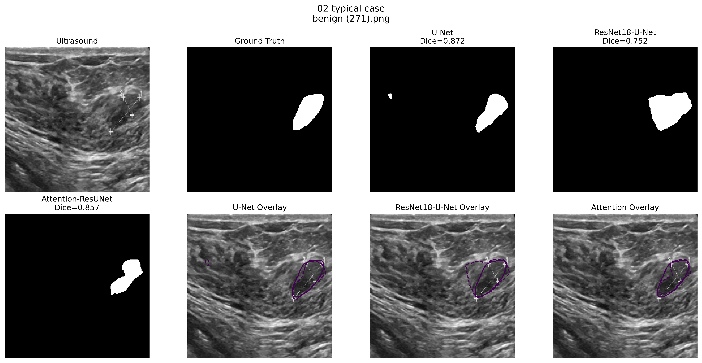
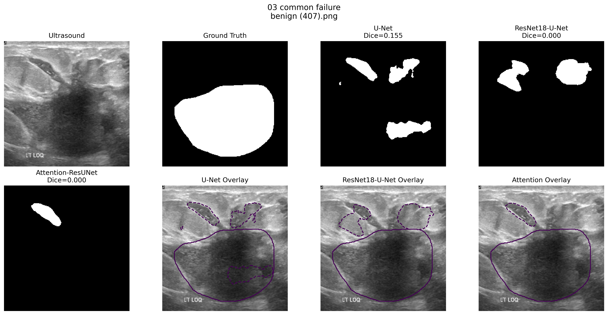

# 1.结果
Scratch U-Net
Dice 0.7382
        ↓
ResNet18-U-Net
Dice 0.8377
提升非常明显，说明在BUSI这种有限的数据规模下，迁移学习得到的预训练视觉特征显著提升了病灶分割的泛化能力。
ResNet18-U-Net
0.8377
        ↓
Attention ResNet
0.8008
说明更复杂的注意力结构并不必然带来性能的提升。
## 提问：为什么attention反而下降？
在统一训练协议下，预训练 ResNet18 Encoder 已经提供了较强的表征能力。额外加入 scSE 后增加了模型复杂度以及特征重加权过程，而 BUSI 训练样本规模有限，因此 Attention 权重不一定能够充分稳定学习；同时统一的学习率和正则化参数也未必是 Attention 模型的最优超参数。因此该实验说明，在当前数据规模和训练条件下，预训练 Encoder 的收益比额外 Attention 更稳定。

# 2.使用三个模型验证test集的效果
D:\Anaconda_envs\envs\breast_seg\lib\site-packages\albumentations\check_version.py:147: UserWarning: Error fetching version info The read operation timed out
  data = fetch_version_info()
Using device: cpu
Test samples: 98
Loaded dataset: 98 images

Building models...
Loading checkpoints...
All models loaded successfully.
Processed 10/98
Processed 20/98
Processed 30/98
Processed 40/98
Processed 50/98
Processed 60/98
Processed 70/98
Processed 80/98
Processed 90/98

========================================
Standardized Test Results
========================================

U-Net
Dice: 0.6983
IoU : 0.5795

ResNet18-U-Net
Dice: 0.8310
IoU : 0.7377

Attention-ResNet18-U-Net
Dice: 0.7960
IoU : 0.7117

========================================
Selected Cases
========================================
                    reason  index       image_name  unet_dice  resnet_dice  attention_dice  resnet_gain_vs_unet  attention_change_vs_resnet
01_best_resnet_improvement      9 benign (342).png   0.001270 8.384817e-01    6.341556e-11             0.837212               -8.384817e-01
           02_typical_case     36 benign (271).png   0.872006 7.524116e-01    8.570697e-01            -0.119594                1.046581e-01
         03_common_failure     33 benign (407).png   0.155116 3.522243e-11    4.034210e-11            -0.155116                5.119672e-12
  04_attention_degradation      9 benign (342).png   0.001270 8.384817e-01    6.341556e-11             0.837212               -8.384817e-01

Per-sample results:
results\final\prediction_analysis\per_sample_model_comparison.csv

Case figures:
results\final\prediction_analysis\case_comparisons

# 3.实验记录
之前：
U-Net       0.7382
ResNet      0.8377
Attention   0.8008

现在：
U-Net       0.6983
ResNet      0.8310
Attention   0.7960

ResNet 和 Attention 只变化了约：
0.0067
0.0048

非常小。
Baseline 变化较大。
原因很可能来自两个地方：你现在的脚本是逐样本算 Dice 再对 98 个样本求平均；而旧训练脚本如果是先求每个 batch 的平均 Dice，再对 batch 求平均，那么最后不足一个完整 batch 的样本会被不成比例地加权。除此以外，Baseline 原训练流程与高级模型的 resize 路径也有细微差异。
所以从项目严谨性上：以后统一以这次逐样本标准化评估结果为准。

# 4.病例结果分析

这个病例特别漂亮：
U-Net            Dice = 0.001
ResNet18-U-Net   Dice = 0.838
Attention        Dice ≈ 0

Ground Truth 是一个很大的病灶。
Baseline 几乎：
完全漏检。

Attention 也：
几乎完全漏检。

而 ResNet18-U-Net：
成功恢复了大部分病灶区域，而且轮廓与 GT 已经相当接近。

所以这个病例非常适合作为 README 的核心 Case Study。
它还能推翻一个很重要的误区：
模型失败并不只是因为病灶太小。

这个病灶明明很大，U-Net 和 Attention 仍然几乎完全失败。

！！！最值得注意的是，同一个 benign (342).png 同时成为：
Best ResNet Improvement
+
Worst Attention Degradation

数值是：
U-Net      0.001
       ↓
ResNet      0.838
       ↓
Attention   ≈0

这是一个非常强的 Failure Case。
它说明：
scSE Attention 并不是在 ResNet 的结果上“稍微修一修”，而是在某些样本上可能出现接近灾难性的预测退化。

一种合理假设是：
ResNet feature
       ↓
scSE feature reweighting
       ↓
某些本来重要的 lesion feature
被赋予过低权重
       ↓
模型对病灶整体响应降低
       ↓
threshold=0.5 后
几乎全部消失

但这里一定要注意措辞。
我们现在不能证明：
“Attention 把病灶抑制掉了。”

我们只能说：
该病例表现与 Attention 特征重加权导致有效病灶特征被过度抑制的假设一致，后续可通过 attention map / feature visualization 进一步验证。

这里：
U-Net       0.872
ResNet      0.752
Attention   0.857

反而是 U-Net 最好。
这说明：
ResNet18-U-Net 虽然总体平均性能最好，但并不是每个病例都最好。

从图上也能看到，ResNet 的预测区域有比较明显的：
over-segmentation。

也就是说它把病灶周围的一部分组织一起包含进来了。
我没有只挑对自己模型有利的结果；模型性能存在明显病例异质性，所以除了总体 Dice/IoU，我进一步做了 per-case analysis。

这个病例：
U-Net       Dice = 0.155
ResNet      Dice ≈ 0
Attention   Dice ≈ 0

三个模型都失败。
尤其值得注意的是：
这同样不是一个“小病灶”。

Ground Truth 是很大的中央病灶，但三个模型主要预测了上方的一些组织结构，出现严重：
False Positive
+
False Negative

这提示真正的困难可能不只是：
lesion size

还有：
低对比度
内部回声异质性
边界模糊
声影
与正常组织纹理相似

这个结论和你之前观察“大病灶也会严重欠分割”完全一致。

# 5.最后的实验结论
采用 ImageNet 预训练 ResNet18 编码器并结合数据增强，将 Test Dice 从 0.6983 提升至 0.8310，IoU 从 0.5795 提升至 0.7377。在当前统一实验条件下，额外加入 scSE Attention 未获得进一步性能收益。
在 BUSI 乳腺超声病灶分割任务上，构建 Scratch U-Net、ResNet18-U-Net 与 scSE Attention-ResNet18-U-Net 三种模型，并在独立测试集上进行逐病例标准化评估。采用 ImageNet 预训练 ResNet18 编码器并结合数据增强后，Test Dice 从 0.6983 提升至 0.8310，IoU 从 0.5795 提升至 0.7377；进一步加入 scSE Attention 后 Dice 为 0.7960，未获得额外增益。病例级分析进一步发现，模型性能下降并不局限于小病灶，部分大病灶同样存在完全漏检，同时 Attention 在部分病例中出现明显退化。

# 两个问题明天来做：1.这个网页为什么展示正确的mask？应该展示一下？ 2.之前生成了所有图像的处理结果表格，我们要可视化一下那个表格，看看是不是resunet的效果更好