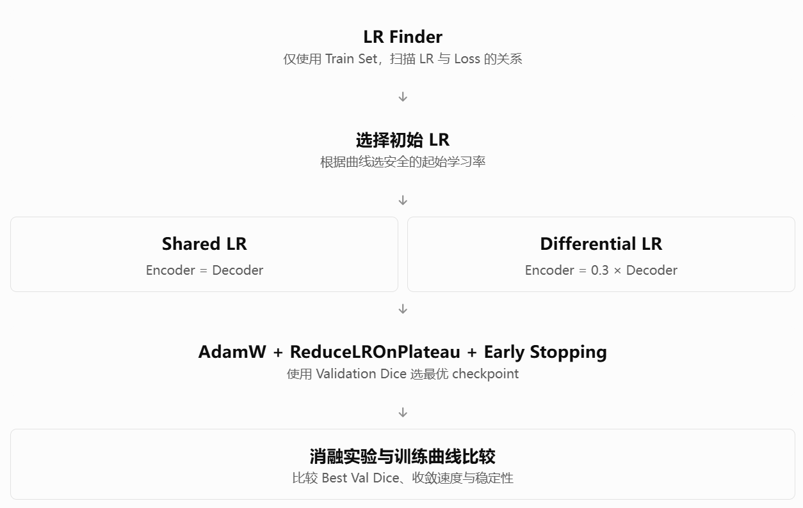
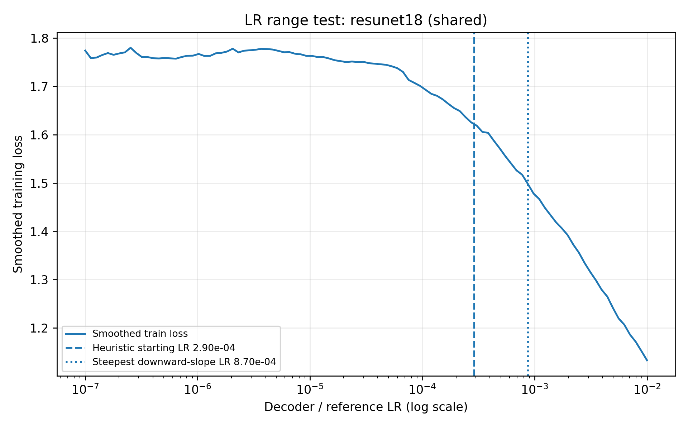
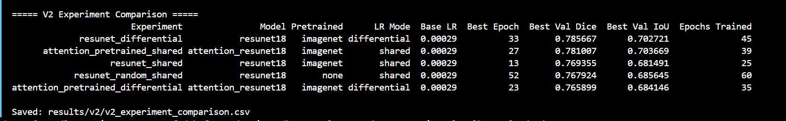

### 科学问题
问题 A：ImageNet 预训练是否有帮助？
保持 ResNet18-U-Net 结构和训练策略一致，仅对比 Encoder 初始化。
问题 B：预训练模型使用差分学习率，是否比共享学习率更好？
保持模型、初始化、数据增强和优化器一致，只改变 Encoder 与 Decoder 的学习率分配。
实验	模型	ImageNet 预训练	学习率方式
V2-A	ResNet18-U-Net	✓	Shared LR
V2-B	ResNet18-U-Net	✓	Differential LR
V2-C	ResNet18-U-Net	×	Shared LR
V2-D	Attention-ResNet18-U-Net	✓	Shared LR
V2-E	Attention-ResNet18-U-Net	✓	Differential LR

### 运行lr_finder
python -m src.lr_finder \
  --data_root /root/datasets/BUSI/Dataset_BUSI_with_GT \
  --model resunet18 \
  --pretrained imagenet \
  --lr_mode shared \
  --min_lr 1e-7 \
  --max_lr 1e-2 \
  --num_iters 100 \
  --batch_size 16 \
  --num_workers 2 \
  --save_dir results/v2/lr_finder_resunet18

  运行结果：
  LR Finder device: cuda
Model: resunet18, init: imagenet, LR mode: shared
Loaded dataset: 452 images
Step  10: base LR=2.848e-07, smooth loss=1.7691
Step  20: base LR=9.112e-07, smooth loss=1.7635
Step  30: base LR=2.915e-06, smooth loss=1.7746
Step  40: base LR=9.326e-06, smooth loss=1.7629
Step  50: base LR=2.984e-05, smooth loss=1.7508
Step  60: base LR=9.545e-05, smooth loss=1.7010
Step  70: base LR=3.054e-04, smooth loss=1.6185
Step  80: base LR=9.770e-04, smooth loss=1.4783
Step  90: base LR=3.126e-03, smooth loss=1.3159
Step 100: base LR=1.000e-02, smooth loss=1.1332

Model: resunet18
Pretrained: imagenet
LR mode: shared
Encoder ratio: 0.3
LR at steepest smoothed-loss decrease: 0.000869749
Suggested decoder/reference initial LR (heuristic): 0.00028991633
If differential: suggested encoder LR: 0.00028991633
IMPORTANT: inspect the curve; this is not a proven optimum.

这个图有一个问题就是不是山谷状的收敛的样子。
# 找到 Loss 下降斜率最负的位置
slope_idx = lo + int(np.argmin(slope[lo:hi]))

# 该位置对应的学习率
fastest_drop_lr = float(
    results.iloc[slope_idx]["decoder_lr"]
)

# 选择一个更保守的初始学习率
suggested = fastest_drop_lr / 3.0  #这里的 ÷3 是经验启发式规则，不是理论上推导出的最优比例。

### 基本参数配置
# 数据集路径
DATA_ROOT=/root/datasets/BUSI/Dataset_BUSI_with_GT

# 请与 A/B 实际使用的 base_lr 保持一致
BASE_LR=0.00028991633

# 三个实验共用的训练参数
COMMON=(
  --data_root "$DATA_ROOT"
  --base_lr "$BASE_LR"
  --batch_size 16
  --epochs 60
  --min_epochs 15
  --num_workers 2
  --seed 42
  --weight_decay 1e-4
  --augmentation
  --lr_factor 0.5
  --lr_patience 3
  --early_stop_patience 12
)

### V2-A实验：共享学习率
# 例子：实际运行前替换为 Finder 选出的值
BASE_LR=0.00028991633

# V2-A：共享学习率
python -m src.train_v2 \
  --data_root /root/datasets/BUSI/Dataset_BUSI_with_GT \
  --model resunet18 \
  --pretrained imagenet \
  --lr_mode shared \
  --base_lr "$BASE_LR" \
  --epochs 60 \
  --batch_size 16 \
  --save_dir results/v2/resunet_shared

运行结果：
Device: cuda
GPU: NVIDIA GeForce RTX 4090 D
Loaded dataset: 452 images
Loaded dataset: 97 images
Train / Validation: 452 97
Model: resunet18 | init=imagenet | LR mode=shared
Initial LRs: {'encoder_lr': 0.00028991633, 'decoder_lr': 0.00028991633}
Test data are intentionally NOT read by this training script.
Epoch 1/60: 100%|███████████████████████████████████████████████████████████████████████████████████████████████████| 29/29 [00:03<00:00,  9.15it/s]
Epoch 1: train_loss=1.3843, val_loss=1.7245, val_dice=0.4045, val_iou=0.2808, encoder_lr=2.90e-04, decoder_lr=2.90e-04, best=YES
Epoch 2/60: 100%|███████████████████████████████████████████████████████████████████████████████████████████████████| 29/29 [00:02<00:00,  9.92it/s]
Epoch 2: train_loss=1.0362, val_loss=0.9855, val_dice=0.6731, val_iou=0.5651, encoder_lr=2.90e-04, decoder_lr=2.90e-04, best=YES
Epoch 3/60: 100%|███████████████████████████████████████████████████████████████████████████████████████████████████| 29/29 [00:02<00:00,  9.92it/s]
Epoch 3: train_loss=0.8749, val_loss=0.8868, val_dice=0.6185, val_iou=0.4861, encoder_lr=2.90e-04, decoder_lr=2.90e-04, best=no
Epoch 4/60: 100%|███████████████████████████████████████████████████████████████████████████████████████████████████| 29/29 [00:02<00:00,  9.89it/s]
Epoch 4: train_loss=0.7614, val_loss=0.8223, val_dice=0.6293, val_iou=0.5102, encoder_lr=2.90e-04, decoder_lr=2.90e-04, best=no
Epoch 5/60: 100%|███████████████████████████████████████████████████████████████████████████████████████████████████| 29/29 [00:03<00:00,  9.54it/s]
Epoch 5: train_loss=0.6871, val_loss=0.7382, val_dice=0.6921, val_iou=0.5794, encoder_lr=2.90e-04, decoder_lr=2.90e-04, best=YES
Epoch 6/60: 100%|███████████████████████████████████████████████████████████████████████████████████████████████████| 29/29 [00:02<00:00,  9.74it/s]
Epoch 6: train_loss=0.6207, val_loss=0.6274, val_dice=0.7274, val_iou=0.6237, encoder_lr=2.90e-04, decoder_lr=2.90e-04, best=YES
Epoch 7/60: 100%|███████████████████████████████████████████████████████████████████████████████████████████████████| 29/29 [00:02<00:00, 10.72it/s]
Epoch 7: train_loss=0.5407, val_loss=0.6195, val_dice=0.7167, val_iou=0.6168, encoder_lr=2.90e-04, decoder_lr=2.90e-04, best=no
Epoch 8/60: 100%|███████████████████████████████████████████████████████████████████████████████████████████████████| 29/29 [00:02<00:00, 10.74it/s]
Epoch 8: train_loss=0.4965, val_loss=0.5346, val_dice=0.7303, val_iou=0.6320, encoder_lr=2.90e-04, decoder_lr=2.90e-04, best=YES
Epoch 9/60: 100%|███████████████████████████████████████████████████████████████████████████████████████████████████| 29/29 [00:02<00:00, 10.77it/s]
Epoch 9: train_loss=0.4318, val_loss=0.5504, val_dice=0.7405, val_iou=0.6517, encoder_lr=2.90e-04, decoder_lr=2.90e-04, best=YES
Epoch 10/60: 100%|██████████████████████████████████████████████████████████████████████████████████████████████████| 29/29 [00:02<00:00, 10.80it/s]
Epoch 10: train_loss=0.4017, val_loss=0.5045, val_dice=0.7304, val_iou=0.6295, encoder_lr=2.90e-04, decoder_lr=2.90e-04, best=no
Epoch 11/60: 100%|██████████████████████████████████████████████████████████████████████████████████████████████████| 29/29 [00:02<00:00, 10.65it/s]
Epoch 11: train_loss=0.3784, val_loss=0.5204, val_dice=0.7313, val_iou=0.6383, encoder_lr=2.90e-04, decoder_lr=2.90e-04, best=no
Epoch 12/60: 100%|██████████████████████████████████████████████████████████████████████████████████████████████████| 29/29 [00:02<00:00, 10.46it/s]
Epoch 12: train_loss=0.3389, val_loss=0.4824, val_dice=0.7479, val_iou=0.6581, encoder_lr=2.90e-04, decoder_lr=2.90e-04, best=YES
Epoch 13/60: 100%|██████████████████████████████████████████████████████████████████████████████████████████████████| 29/29 [00:02<00:00, 10.70it/s]
Epoch 13: train_loss=0.3271, val_loss=0.4281, val_dice=0.7694, val_iou=0.6815, encoder_lr=2.90e-04, decoder_lr=2.90e-04, best=YES
Epoch 14/60: 100%|██████████████████████████████████████████████████████████████████████████████████████████████████| 29/29 [00:02<00:00, 10.64it/s]
Epoch 14: train_loss=0.2977, val_loss=0.4532, val_dice=0.7547, val_iou=0.6604, encoder_lr=2.90e-04, decoder_lr=2.90e-04, best=no
Epoch 15/60: 100%|██████████████████████████████████████████████████████████████████████████████████████████████████| 29/29 [00:02<00:00, 10.54it/s]
Epoch 15: train_loss=0.2808, val_loss=0.4611, val_dice=0.7449, val_iou=0.6555, encoder_lr=2.90e-04, decoder_lr=2.90e-04, best=no
Epoch 16/60: 100%|██████████████████████████████████████████████████████████████████████████████████████████████████| 29/29 [00:02<00:00, 10.73it/s]
Epoch 16: train_loss=0.3673, val_loss=0.4513, val_dice=0.7420, val_iou=0.6525, encoder_lr=2.90e-04, decoder_lr=2.90e-04, best=no
Epoch 17/60: 100%|██████████████████████████████████████████████████████████████████████████████████████████████████| 29/29 [00:02<00:00, 10.70it/s]
Epoch 17: train_loss=0.3772, val_loss=0.5472, val_dice=0.7074, val_iou=0.5988, encoder_lr=2.90e-04, decoder_lr=2.90e-04, best=no
Epoch 18/60: 100%|██████████████████████████████████████████████████████████████████████████████████████████████████| 29/29 [00:02<00:00, 10.64it/s]
Epoch 18: train_loss=0.3087, val_loss=0.4339, val_dice=0.7543, val_iou=0.6700, encoder_lr=1.45e-04, decoder_lr=1.45e-04, best=no
Epoch 19/60: 100%|██████████████████████████████████████████████████████████████████████████████████████████████████| 29/29 [00:02<00:00, 10.79it/s]
Epoch 19: train_loss=0.2620, val_loss=0.4503, val_dice=0.7432, val_iou=0.6569, encoder_lr=1.45e-04, decoder_lr=1.45e-04, best=no
Epoch 20/60: 100%|██████████████████████████████████████████████████████████████████████████████████████████████████| 29/29 [00:02<00:00, 10.51it/s]
Epoch 20: train_loss=0.2459, val_loss=0.4187, val_dice=0.7676, val_iou=0.6863, encoder_lr=1.45e-04, decoder_lr=1.45e-04, best=no
Epoch 21/60: 100%|██████████████████████████████████████████████████████████████████████████████████████████████████| 29/29 [00:02<00:00, 10.56it/s]
Epoch 21: train_loss=0.2322, val_loss=0.4239, val_dice=0.7644, val_iou=0.6802, encoder_lr=1.45e-04, decoder_lr=1.45e-04, best=no
Epoch 22/60: 100%|██████████████████████████████████████████████████████████████████████████████████████████████████| 29/29 [00:02<00:00, 10.83it/s]
Epoch 22: train_loss=0.2281, val_loss=0.4130, val_dice=0.7684, val_iou=0.6814, encoder_lr=7.25e-05, decoder_lr=7.25e-05, best=no
Epoch 23/60: 100%|██████████████████████████████████████████████████████████████████████████████████████████████████| 29/29 [00:02<00:00, 10.66it/s]
Epoch 23: train_loss=0.2106, val_loss=0.4255, val_dice=0.7633, val_iou=0.6784, encoder_lr=7.25e-05, decoder_lr=7.25e-05, best=no
Epoch 24/60: 100%|██████████████████████████████████████████████████████████████████████████████████████████████████| 29/29 [00:02<00:00, 10.56it/s]
Epoch 24: train_loss=0.2146, val_loss=0.4285, val_dice=0.7614, val_iou=0.6775, encoder_lr=7.25e-05, decoder_lr=7.25e-05, best=no
Epoch 25/60: 100%|██████████████████████████████████████████████████████████████████████████████████████████████████| 29/29 [00:02<00:00, 10.68it/s]
Epoch 25: train_loss=0.2002, val_loss=0.4382, val_dice=0.7515, val_iou=0.6705, encoder_lr=7.25e-05, decoder_lr=7.25e-05, best=no
Early stopping at epoch 25

==== TRAIN/VAL COMPLETED ====
{
  "model": "resunet18",
  "pretrained": "imagenet",
  "lr_mode": "shared",
  "base_lr": 0.00028991633,
  "encoder_ratio": 0.3,
  "weight_decay": 0.0001,
  "augmentation": true,
  "best_epoch": 13,
  "best_val_dice": 0.7693553917186776,
  "epochs_completed": 25
}
Files: results/v2/resunet_shared
No test metrics have been computed in this run.

### V2-B实验：差分学习率---差分学习率的优势在于：预训练 Encoder 只进行相对温和的微调，新初始化的 Decoder 和 Attention 模块可以更新得更快。
python -m src.train_v2 \
  --data_root /root/datasets/BUSI/Dataset_BUSI_with_GT \
  --model resunet18 \
  --pretrained imagenet \
  --lr_mode differential \
  --base_lr "$BASE_LR" \
  --encoder_ratio 0.3 \
  --epochs 60 \
  --batch_size 16 \
  --save_dir results/v2/resunet_differential

  运行结果：
  #Device: cuda
GPU: NVIDIA GeForce RTX 4090 D
Loaded dataset: 452 images
Loaded dataset: 97 images
Train / Validation: 452 97
Model: resunet18 | init=imagenet | LR mode=differential
Initial LRs: {'encoder_lr': 8.6974899e-05, 'decoder_lr': 0.00028991633}
Test data are intentionally NOT read by this training script.
Epoch 1/60: 100%|██████████████████████████████████████████████████████| 29/29 [00:03<00:00,  8.72it/s]
Epoch 1: train_loss=1.4071, val_loss=1.5009, val_dice=0.3742, val_iou=0.2522, encoder_lr=8.70e-05, decoder_lr=2.90e-04, best=YES
Epoch 2/60: 100%|██████████████████████████████████████████████████████| 29/29 [00:02<00:00, 10.18it/s]
Epoch 2: train_loss=1.0679, val_loss=1.0146, val_dice=0.5871, val_iou=0.4564, encoder_lr=8.70e-05, decoder_lr=2.90e-04, best=YES
Epoch 3/60: 100%|██████████████████████████████████████████████████████| 29/29 [00:02<00:00,  9.93it/s]
Epoch 3: train_loss=0.9034, val_loss=0.9041, val_dice=0.6137, val_iou=0.4826, encoder_lr=8.70e-05, decoder_lr=2.90e-04, best=YES
Epoch 4/60: 100%|██████████████████████████████████████████████████████| 29/29 [00:02<00:00,  9.84it/s]
Epoch 4: train_loss=0.7843, val_loss=0.7651, val_dice=0.6845, val_iou=0.5721, encoder_lr=8.70e-05, decoder_lr=2.90e-04, best=YES
Epoch 5/60: 100%|██████████████████████████████████████████████████████| 29/29 [00:03<00:00,  9.60it/s]
Epoch 5: train_loss=0.6983, val_loss=0.7159, val_dice=0.6980, val_iou=0.5834, encoder_lr=8.70e-05, decoder_lr=2.90e-04, best=YES
Epoch 6/60: 100%|██████████████████████████████████████████████████████| 29/29 [00:02<00:00, 10.61it/s]
Epoch 6: train_loss=0.6251, val_loss=0.6522, val_dice=0.7279, val_iou=0.6299, encoder_lr=8.70e-05, decoder_lr=2.90e-04, best=YES
Epoch 7/60: 100%|██████████████████████████████████████████████████████| 29/29 [00:02<00:00, 10.71it/s]
Epoch 7: train_loss=0.5512, val_loss=0.6231, val_dice=0.7238, val_iou=0.6188, encoder_lr=8.70e-05, decoder_lr=2.90e-04, best=no
Epoch 8/60: 100%|██████████████████████████████████████████████████████| 29/29 [00:02<00:00, 10.67it/s]
Epoch 8: train_loss=0.4949, val_loss=0.5511, val_dice=0.7397, val_iou=0.6372, encoder_lr=8.70e-05, decoder_lr=2.90e-04, best=YES
Epoch 9/60: 100%|██████████████████████████████████████████████████████| 29/29 [00:02<00:00, 10.71it/s]
Epoch 9: train_loss=0.4303, val_loss=0.5159, val_dice=0.7385, val_iou=0.6408, encoder_lr=8.70e-05, decoder_lr=2.90e-04, best=no
Epoch 10/60: 100%|█████████████████████████████████████████████████████| 29/29 [00:02<00:00, 10.81it/s]
Epoch 10: train_loss=0.3854, val_loss=0.5305, val_dice=0.7146, val_iou=0.6119, encoder_lr=8.70e-05, decoder_lr=2.90e-04, best=no
Epoch 11/60: 100%|█████████████████████████████████████████████████████| 29/29 [00:02<00:00, 10.54it/s]
Epoch 11: train_loss=0.3586, val_loss=0.5341, val_dice=0.7106, val_iou=0.5987, encoder_lr=8.70e-05, decoder_lr=2.90e-04, best=no
Epoch 12/60: 100%|█████████████████████████████████████████████████████| 29/29 [00:02<00:00, 10.72it/s]
Epoch 12: train_loss=0.3466, val_loss=0.4787, val_dice=0.7435, val_iou=0.6549, encoder_lr=8.70e-05, decoder_lr=2.90e-04, best=YES
Epoch 13/60: 100%|█████████████████████████████████████████████████████| 29/29 [00:02<00:00, 10.72it/s]
Epoch 13: train_loss=0.3065, val_loss=0.4674, val_dice=0.7373, val_iou=0.6436, encoder_lr=8.70e-05, decoder_lr=2.90e-04, best=no
Epoch 14/60: 100%|█████████████████████████████████████████████████████| 29/29 [00:02<00:00, 10.52it/s]
Epoch 14: train_loss=0.2901, val_loss=0.4518, val_dice=0.7566, val_iou=0.6623, encoder_lr=8.70e-05, decoder_lr=2.90e-04, best=YES
Epoch 15/60: 100%|█████████████████████████████████████████████████████| 29/29 [00:02<00:00, 10.67it/s]
Epoch 15: train_loss=0.2850, val_loss=0.4362, val_dice=0.7547, val_iou=0.6665, encoder_lr=8.70e-05, decoder_lr=2.90e-04, best=no
Epoch 16/60: 100%|█████████████████████████████████████████████████████| 29/29 [00:02<00:00, 10.62it/s]
Epoch 16: train_loss=0.2932, val_loss=0.5061, val_dice=0.7139, val_iou=0.6241, encoder_lr=8.70e-05, decoder_lr=2.90e-04, best=no
Epoch 17/60: 100%|█████████████████████████████████████████████████████| 29/29 [00:02<00:00, 10.43it/s]
Epoch 17: train_loss=0.2902, val_loss=0.4287, val_dice=0.7685, val_iou=0.6861, encoder_lr=8.70e-05, decoder_lr=2.90e-04, best=YES
Epoch 18/60: 100%|█████████████████████████████████████████████████████| 29/29 [00:02<00:00, 10.70it/s]
Epoch 18: train_loss=0.2540, val_loss=0.4194, val_dice=0.7680, val_iou=0.6799, encoder_lr=8.70e-05, decoder_lr=2.90e-04, best=no
Epoch 19/60: 100%|█████████████████████████████████████████████████████| 29/29 [00:02<00:00, 10.75it/s]
Epoch 19: train_loss=0.2347, val_loss=0.4128, val_dice=0.7759, val_iou=0.6895, encoder_lr=8.70e-05, decoder_lr=2.90e-04, best=YES
Epoch 20/60: 100%|█████████████████████████████████████████████████████| 29/29 [00:02<00:00, 10.46it/s]
Epoch 20: train_loss=0.2282, val_loss=0.4381, val_dice=0.7687, val_iou=0.6827, encoder_lr=8.70e-05, decoder_lr=2.90e-04, best=no
Epoch 21/60: 100%|█████████████████████████████████████████████████████| 29/29 [00:02<00:00, 10.65it/s]
Epoch 21: train_loss=0.2411, val_loss=0.4280, val_dice=0.7728, val_iou=0.6888, encoder_lr=8.70e-05, decoder_lr=2.90e-04, best=no
Epoch 22/60: 100%|█████████████████████████████████████████████████████| 29/29 [00:02<00:00, 10.61it/s]
Epoch 22: train_loss=0.2240, val_loss=0.3977, val_dice=0.7768, val_iou=0.6916, encoder_lr=8.70e-05, decoder_lr=2.90e-04, best=YES
Epoch 23/60: 100%|█████████████████████████████████████████████████████| 29/29 [00:02<00:00, 10.65it/s]
Epoch 23: train_loss=0.2132, val_loss=0.3996, val_dice=0.7769, val_iou=0.6915, encoder_lr=8.70e-05, decoder_lr=2.90e-04, best=YES
Epoch 24/60: 100%|█████████████████████████████████████████████████████| 29/29 [00:02<00:00, 10.47it/s]
Epoch 24: train_loss=0.2023, val_loss=0.4166, val_dice=0.7838, val_iou=0.7050, encoder_lr=8.70e-05, decoder_lr=2.90e-04, best=YES
Epoch 25/60: 100%|█████████████████████████████████████████████████████| 29/29 [00:02<00:00, 10.19it/s]
Epoch 25: train_loss=0.1941, val_loss=0.4107, val_dice=0.7825, val_iou=0.7002, encoder_lr=8.70e-05, decoder_lr=2.90e-04, best=no
Epoch 26/60: 100%|█████████████████████████████████████████████████████| 29/29 [00:02<00:00, 10.69it/s]
Epoch 26: train_loss=0.1888, val_loss=0.4266, val_dice=0.7657, val_iou=0.6819, encoder_lr=8.70e-05, decoder_lr=2.90e-04, best=no
Epoch 27/60: 100%|█████████████████████████████████████████████████████| 29/29 [00:02<00:00, 10.59it/s]
Epoch 27: train_loss=0.1797, val_loss=0.4470, val_dice=0.7575, val_iou=0.6789, encoder_lr=8.70e-05, decoder_lr=2.90e-04, best=no
Epoch 28/60: 100%|█████████████████████████████████████████████████████| 29/29 [00:02<00:00, 10.63it/s]
Epoch 28: train_loss=0.1863, val_loss=0.4403, val_dice=0.7617, val_iou=0.6770, encoder_lr=8.70e-05, decoder_lr=2.90e-04, best=no
Epoch 29/60: 100%|█████████████████████████████████████████████████████| 29/29 [00:02<00:00, 10.28it/s]
Epoch 29: train_loss=0.1810, val_loss=0.4120, val_dice=0.7777, val_iou=0.6959, encoder_lr=4.35e-05, decoder_lr=1.45e-04, best=no
Epoch 30/60: 100%|█████████████████████████████████████████████████████| 29/29 [00:02<00:00, 10.77it/s]
Epoch 30: train_loss=0.1726, val_loss=0.4111, val_dice=0.7765, val_iou=0.6952, encoder_lr=4.35e-05, decoder_lr=1.45e-04, best=no
Epoch 31/60: 100%|█████████████████████████████████████████████████████| 29/29 [00:02<00:00, 10.55it/s]
Epoch 31: train_loss=0.1681, val_loss=0.4188, val_dice=0.7708, val_iou=0.6922, encoder_lr=4.35e-05, decoder_lr=1.45e-04, best=no
Epoch 32/60: 100%|█████████████████████████████████████████████████████| 29/29 [00:02<00:00, 10.52it/s]
Epoch 32: train_loss=0.1667, val_loss=0.4276, val_dice=0.7731, val_iou=0.6945, encoder_lr=4.35e-05, decoder_lr=1.45e-04, best=no
Epoch 33/60: 100%|█████████████████████████████████████████████████████| 29/29 [00:02<00:00, 10.73it/s]
Epoch 33: train_loss=0.1591, val_loss=0.4018, val_dice=0.7857, val_iou=0.7027, encoder_lr=2.17e-05, decoder_lr=7.25e-05, best=YES
Epoch 34/60: 100%|█████████████████████████████████████████████████████| 29/29 [00:02<00:00, 10.25it/s]
Epoch 34: train_loss=0.1580, val_loss=0.4176, val_dice=0.7761, val_iou=0.6898, encoder_lr=2.17e-05, decoder_lr=7.25e-05, best=no
Epoch 35/60: 100%|█████████████████████████████████████████████████████| 29/29 [00:02<00:00, 10.79it/s]
Epoch 35: train_loss=0.1548, val_loss=0.4166, val_dice=0.7757, val_iou=0.6915, encoder_lr=2.17e-05, decoder_lr=7.25e-05, best=no
Epoch 36/60: 100%|█████████████████████████████████████████████████████| 29/29 [00:02<00:00, 10.63it/s]
Epoch 36: train_loss=0.1482, val_loss=0.4243, val_dice=0.7725, val_iou=0.6889, encoder_lr=2.17e-05, decoder_lr=7.25e-05, best=no
Epoch 37/60: 100%|█████████████████████████████████████████████████████| 29/29 [00:02<00:00, 10.61it/s]
Epoch 37: train_loss=0.1459, val_loss=0.4255, val_dice=0.7731, val_iou=0.6910, encoder_lr=2.17e-05, decoder_lr=7.25e-05, best=no
Epoch 38/60: 100%|█████████████████████████████████████████████████████| 29/29 [00:02<00:00, 10.48it/s]
Epoch 38: train_loss=0.1513, val_loss=0.4180, val_dice=0.7753, val_iou=0.6930, encoder_lr=1.09e-05, decoder_lr=3.62e-05, best=no
Epoch 39/60: 100%|█████████████████████████████████████████████████████| 29/29 [00:02<00:00, 10.64it/s]
Epoch 39: train_loss=0.1411, val_loss=0.4235, val_dice=0.7772, val_iou=0.6955, encoder_lr=1.09e-05, decoder_lr=3.62e-05, best=no
Epoch 40/60: 100%|█████████████████████████████████████████████████████| 29/29 [00:02<00:00, 10.17it/s]
Epoch 40: train_loss=0.1429, val_loss=0.4274, val_dice=0.7747, val_iou=0.6925, encoder_lr=1.09e-05, decoder_lr=3.62e-05, best=no
Epoch 41/60: 100%|█████████████████████████████████████████████████████| 29/29 [00:02<00:00, 10.65it/s]
Epoch 41: train_loss=0.1476, val_loss=0.4220, val_dice=0.7769, val_iou=0.6947, encoder_lr=1.09e-05, decoder_lr=3.62e-05, best=no
Epoch 42/60: 100%|█████████████████████████████████████████████████████| 29/29 [00:02<00:00, 10.58it/s]
Epoch 42: train_loss=0.1423, val_loss=0.4214, val_dice=0.7760, val_iou=0.6950, encoder_lr=5.44e-06, decoder_lr=1.81e-05, best=no
Epoch 43/60: 100%|█████████████████████████████████████████████████████| 29/29 [00:02<00:00, 10.71it/s]
Epoch 43: train_loss=0.1430, val_loss=0.4234, val_dice=0.7764, val_iou=0.6945, encoder_lr=5.44e-06, decoder_lr=1.81e-05, best=no
Epoch 44/60: 100%|█████████████████████████████████████████████████████| 29/29 [00:02<00:00, 10.75it/s]
Epoch 44: train_loss=0.1374, val_loss=0.4232, val_dice=0.7764, val_iou=0.6946, encoder_lr=5.44e-06, decoder_lr=1.81e-05, best=no
Epoch 45/60: 100%|█████████████████████████████████████████████████████| 29/29 [00:02<00:00, 10.60it/s]
Epoch 45: train_loss=0.1406, val_loss=0.4196, val_dice=0.7769, val_iou=0.6952, encoder_lr=5.44e-06, decoder_lr=1.81e-05, best=no
Early stopping at epoch 45

==== TRAIN/VAL COMPLETED ====
{
  "model": "resunet18",
  "pretrained": "imagenet",
  "lr_mode": "differential",
  "base_lr": 0.00028991633,
  "encoder_ratio": 0.3,
  "weight_decay": 0.0001,
  "augmentation": true,
  "best_epoch": 33,
  "best_val_dice": 0.785666784674851,
  "epochs_completed": 45
}
Files: results/v2/resunet_differential
No test metrics have been computed in this run.

### v2-C实验：resunet去掉imagenet预训练
运行结果：
==== TRAIN/VAL COMPLETED ====
{
  "model": "resunet18",
  "pretrained": "none",
  "lr_mode": "shared",
  "base_lr": 0.00028991633,
  "encoder_ratio": 0.3,
  "weight_decay": 0.0001,
  "augmentation": true,
  "best_epoch": 52,
  "best_val_dice": 0.7679244135458445,
  "epochs_completed": 60
}
Files: results/v2/resunet_random_shared
No test metrics have been computed in this run.

### 实验 v2-D：Attention + Shared LR
==== TRAIN/VAL COMPLETED ====
{
  "model": "attention_resunet18",
  "pretrained": "imagenet",
  "lr_mode": "shared",
  "base_lr": 0.00028991633,
  "encoder_ratio": 0.3,
  "weight_decay": 0.0001,
  "augmentation": true,
  "best_epoch": 27,
  "best_val_dice": 0.7810074871348351,
  "epochs_completed": 39
}
Files: results/v2/attention_pretrained_shared
No test metrics have been computed in this run.

### v2-E：Attention + Differential LR
python -m src.train_v2 \
  "${COMMON[@]}" \
  --model attention_resunet18 \
  --pretrained imagenet \
  --lr_mode differential \
  --encoder_ratio 0.3 \
  --save_dir results/v2/attention_pretrained_differential

  运行结果：
  ==== TRAIN/VAL COMPLETED ====
{
  "model": "attention_resunet18",
  "pretrained": "imagenet",
  "lr_mode": "differential",
  "base_lr": 0.00028991633,
  "encoder_ratio": 0.3,
  "weight_decay": 0.0001,
  "augmentation": true,
  "best_epoch": 23,
  "best_val_dice": 0.7658989380315407,
  "epochs_completed": 35
}
Files: results/v2/attention_pretrained_differential
No test metrics have been computed in this run.

### 最后的结果

根据最后的结果，目前 B 是验证集 Dice 的最佳方案，但 D 的验证集 IoU 略高于 B，说明两个指标的排名不完全一致。
观察 A、B、C：
- A：预训练 + Shared LR，最佳 Epoch = 13。
- B：预训练 + Differential LR，最佳 Epoch = 33。
- C：随机初始化 + Shared LR，最佳 Epoch = 52。
C 训练了较长时间才达到最佳验证性能，而预训练模型 A、B 更早达到各自的最佳点。
这提示：预训练可能有助于加快收敛，但目前没有充分证据表明它一定提高最终最佳 Dice。
#### 根据结果进行5组消融对比，结果显示：
A vs B：差分学习率对 ResNet 有帮助
Best Val Dice：0.7694 → 0.7857

+1.63 pp

A vs C：ImageNet 预训练的最高分优势很小
随机初始化 0.7679 → 预训练 0.7694

+0.14 pp

A vs D：共享 LR 下，Attention 略好
Best Val Dice：0.7694 → 0.7810

+1.17 pp

B vs E：差分 LR 下，Attention 反而下降
Best Val Dice：0.7857 → 0.7659

−1.98 pp

pp = 百分点。上述差异均来自单一随机种子、一次训练的最佳验证结果，不能直接作为统计显著性结论。这里有三个重要发现。
第一，差分学习率不是对所有模型都有帮助。 ResNet 改善了，但 Attention 变差了，说明最佳微调策略可能与模型结构有关。
第二，预训练的优势可能更多体现在收敛效率，而不只是最终分数。 C 的最佳 Epoch 晚于 A/B，但要查看学习曲线才能确认是否持续体现这一趋势。
第三，Attention 的性能高度依赖训练策略。 这与 V1 中观察到的部分病例严重退化现象相呼应，但 V2 的总体 CSV 还无法证明两者具有相同原因。

## 把 V1 最佳 ResNet 和 V2 最佳 ResNet 都放到同一批 97 张 Validation 图像上，使用完全相同的预处理和 Dice 计算方法重新评价。
Loaded dataset: 97 images

 V1_ResUNet
Val Dice: 0.7521
Val IoU: 0.6708

 V2_ResUNet_Differential
Val Dice: 0.7857
Val IoU: 0.7027

Completed.
确实使用差分学习率可以使结果变好。
